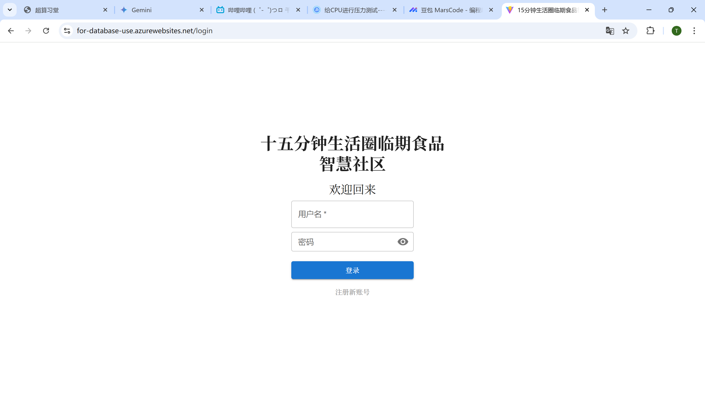
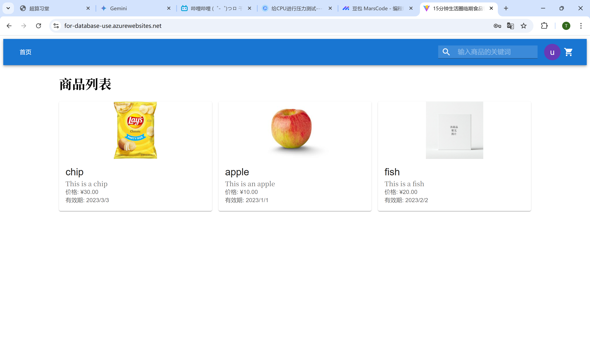
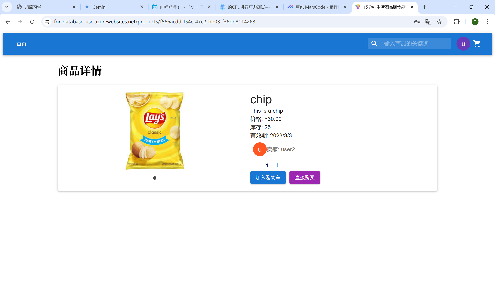
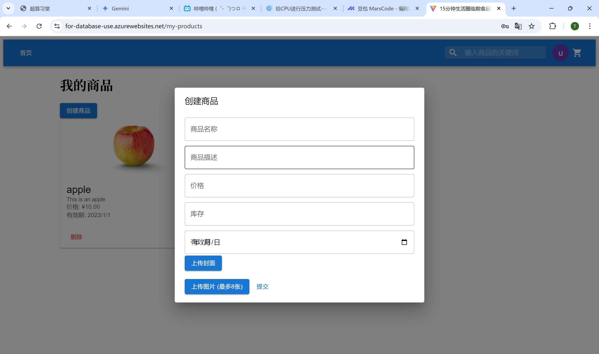
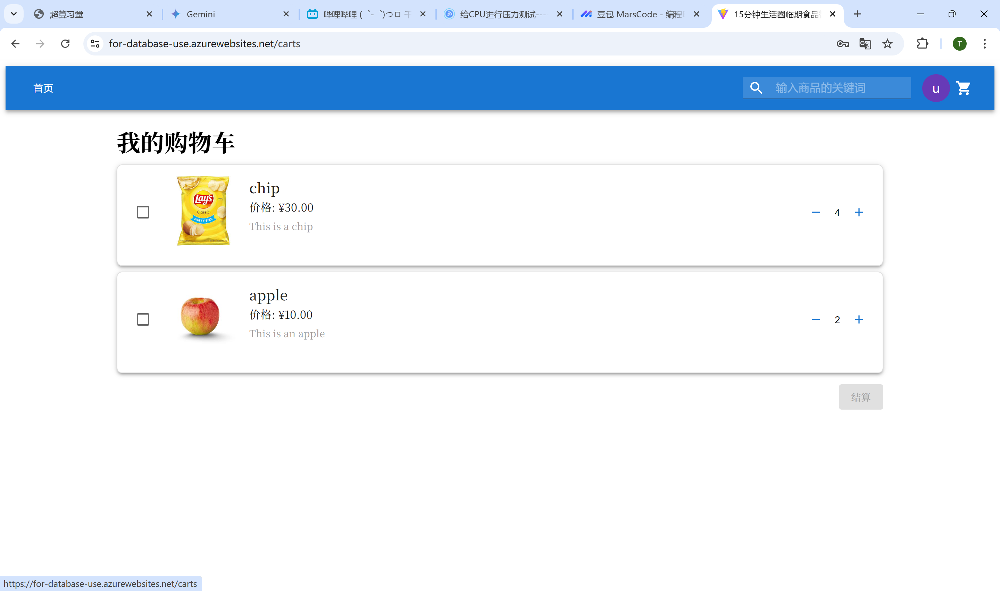
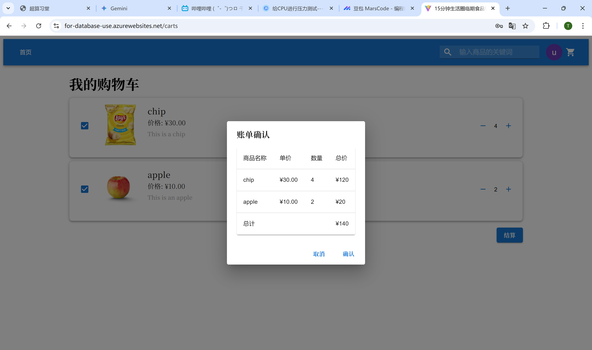
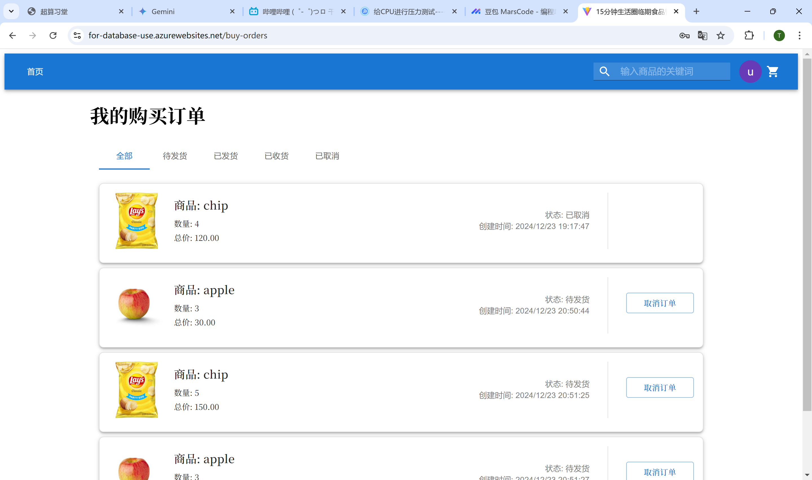

# Expired-Food-Smart-Community (食材管理智能社区)
[👉 直达项目演示](#项目演示--project-demonstration)
## 项目简介 | Project Overview
本项目是为解决社区“临期食品”资源浪费问题，提升社区生活便利性而设计的**全栈Web应用**。平台旨在构建一个连接社区居民的桥梁，让用户可以作为**卖家**发布家中临期食品信息，同时作为**买家**及时获取社区内的优惠食品资源，实现食品资源的高效流通和社区资源的有效利用。

**业务价值：**
- 构建社区居民间的临期食品交易平台，促进资源高效流通
- 通过C2C模式连接买卖双方，实现社区共享经济
- 帮助用户低价获取临期食品，实现多方共赢

**技术亮点：**
- 采用前后端分离架构，确保系统高扩展性
- 实现基于 JWT 的用户认证，保证系统安全性
- 使用 Sequelize ORM 优化数据库操作，提升性能
- 引入幂等性设计，保证交易安全与数据一致性

本项目是中山大学数据数据库系统原理课程小组项目成果，由 曹芷昕 与 陈悦敏 共同完成


## 技术栈 | Tech Stack
| 分类 | 技术 | 说明 |
|------|------|------|
| 前端 | React | UI框架 |
| | Material-UI | 组件库 |
| | React Router | 路由管理 |
| | Axios | HTTP客户端 |
| 后端 | Node.js | 运行环境 |
| | Express.js | Web框架 |
| | Sequelize | ORM框架 |
| | JWT | 身份认证 |
| 数据库 | PostgreSQL | 关系型数据库 |

## 项目演示 | Project Demonstration

### 1. 用户认证界面
- **登录界面 (Login Page)**：用户可输入账号密码进行登录认证


### 2. 商品相关界面
- **商品列表 (Product List)**：展示所有在售商品，可进行筛选和搜索


- **商品详情 (Product Detail)**：展示商品详细信息，包括价格、库存等


- **发布商品 (Create Product)**：卖家发布新商品的操作界面


### 3. 购物与订单界面
- **购物车 (Shopping Cart)**：管理待购买商品


- **结账界面 (Checkout)**：购物车商品结算页面


- **订单管理 (Order Management)**：查看和管理购买订单



## 项目详解
### 项目亮点 (Key Features & Highlights)

- **1. 高性能数据库设计 | High-Performance Database Design**
    -   **关系型数据库范式 | Relational Database Paradigm:**  遵循关系型数据库设计范式，确保数据表结构规范化，减少数据冗余，提高数据一致性。
    -   **Sequelize ORM 优化查询性能 | Sequelize ORM for Query Optimization:**  采用 Sequelize ORM 框架，提供高效的数据库操作接口，通过预加载 (eager loading)、延迟加载 (lazy loading) 等策略优化多表关联查询性能，提升数据访问效率。
    -   **完善的事务管理 | Robust Transaction Management:**  在订单创建、支付等核心交易流程中，深入应用数据库事务，保证数据操作的 ACID 特性 (原子性、一致性、隔离性、持久性)，确保数据完整性和业务逻辑的正确执行。

- **2. 安全可靠的系统架构 | Secure and Reliable System Architecture**
    -   **JWT + Cookie 实现安全认证 | JWT + Cookie for Secure Authentication:**  采用 JWT (JSON Web Token)  机制进行用户身份认证，结合 Cookie 存储 JWT，实现安全可靠的用户身份验证和会话管理，有效防止跨站请求伪造 (CSRF) 等安全风险。
    -   **接口幂等性设计 | Idempotent API Design:**  针对订单创建等关键接口，引入幂等性 Key 机制，防止用户重复提交请求，避免重复创建订单或重复支付等问题，增强系统在网络异常或高并发场景下的可靠性。
    -   **完整的错误处理机制 | Comprehensive Error Handling:**  系统前后端均实现完善的错误处理机制，能够有效捕获、记录和处理运行时错误，并向用户返回友好的错误提示信息，提升用户体验和系统健壮性。

- **3. 良好的代码规范与可维护性 | Good Code Practices & Maintainability**
    -   **遵循 RESTful API 设计规范 | RESTful API Design Principles:**  后端 API 设计严格遵循 RESTful 架构风格，使用标准 HTTP 方法 (GET, POST, PUT, DELETE) 和状态码，接口语义清晰，易于理解和维护，降低前后端联调和维护成本。
    -   **组件化开发模式 | Component-Based Development:**  前端采用 React 组件化开发模式，将 UI 界面拆分为独立、可复用的组件，提高代码复用率和开发效率，降低代码维护难度，方便后续功能扩展和迭代。
    -   **前后端分离架构 | Separated Frontend and Backend:**  采用前后端分离的架构模式，前后端代码逻辑解耦，便于团队分工协作，提高开发效率；同时，后端 API 可服务于多种客户端 (Web, Mobile App 等)，提升系统灵活性和可扩展性。

### 核心模块与功能 (Key Modules and Features)

-  **用户模块 (User Module):**
    -  用户注册/登录 (Registration/Login)
    -  修改个人信息 (Update Profile)
    -  账户充值/账单查询 (Account Top-up/Bill Inquiry)
-  **商品模块 (Product Module):**
    -  卖家发布商品信息 (Seller Product Listing)
    -  商品浏览/搜索 (Product Browsing/Search)
    -  商品详情查看 (Product Detail View)
-  **购物车模块 (Cart Module):**
    -  商品加入购物车 (Add to Cart)
    -  购物车商品数量修改 (Modify Cart Item Quantity)
    -  购物车商品删除 (Remove Cart Item)
    -  购物车结算 (Checkout from Cart)
-  **订单模块 (Order Module):**
    -  创建订单 (Create Order - Single Product & Cart Checkout)
    -  订单查询 (Order Inquiry - Buyer & Seller)
    -  订单状态变更 (Order Status Update - Cancel, Confirm Receipt, Complete Delivery)
    -  订单评价 (Order Review - Buyer to Seller & Seller to Buyer)
-  **评价模块 (Review Module):**
    -  用户对订单进行评价 (User Review for Orders)
    -  查看用户收到的评价 (View Received Reviews)
  
### 数据库设计 (Database Design)

本项目数据库设计共包含 8 张数据表，详细 ER 图和表结构定义请参考实验报告。

**核心数据表包括：**

-  **user:**  用户信息表，存储用户账号、密码、个人信息等。
-  **product:** 商品信息表，存储商品名称、描述、价格、库存、有效期等。
-  **cart:** 购物车表，记录用户购物车中的商品信息。
-  **order:** 订单表，记录订单信息，关联买家、卖家、商品等。
-  **bill:** 账单表，记录用户账户交易明细，例如充值、支付等。
-  **review:** 评价表，记录用户对订单的评价信息。
-  **idempotencyKey:** 幂等性Key表，用于保证接口的幂等性，防止重复请求。
-  **image:** 图片表，存储商品图片信息。

## 未来展望 (Future Enhancements)

-  **更完善的搜索与推荐功能：**  引入更高级的搜索算法和商品推荐系统，提升用户发现商品的效率。
-  **支付功能集成：**  集成第三方支付平台 (例如支付宝、微信支付)，实现线上支付功能。
-  **消息通知系统：**  增加消息通知功能，例如订单状态更新、商品降价通知等。
-  **移动端适配或开发：**  优化前端界面，提升移动端访问体验，或开发独立的移动端App。
-  **管理员后台管理系统：**  开发后台管理系统，方便平台管理员进行用户管理、商品管理、订单管理等操作。


## 项目启动

```bash
# 克隆项目
git clone https://github.com/EAOrrr/Expired-Food-Smart-Community.git

# 安装依赖
cd frontend
npm install
cd ../backend
npm install

# 启动开发服务器
# 前端
cd frontend
npm run dev

# 后端
cd backend
npm run dev
```


## 开发者 | Developer
- 姓名 | Name: 曹芷昕、陈悦敏。
- 专业 | Major: 计算机科学与技术 | Computer Science and Technology
- 联系方式 | Contact: caozhx7@mail2.sysu.edu.cn


## 贡献 | Contributing
欢迎提出问题和改进建议，请随时提交 Issue 或 Pull Request。

Feel free to submit issues and enhancement requests, and create Pull Requests.